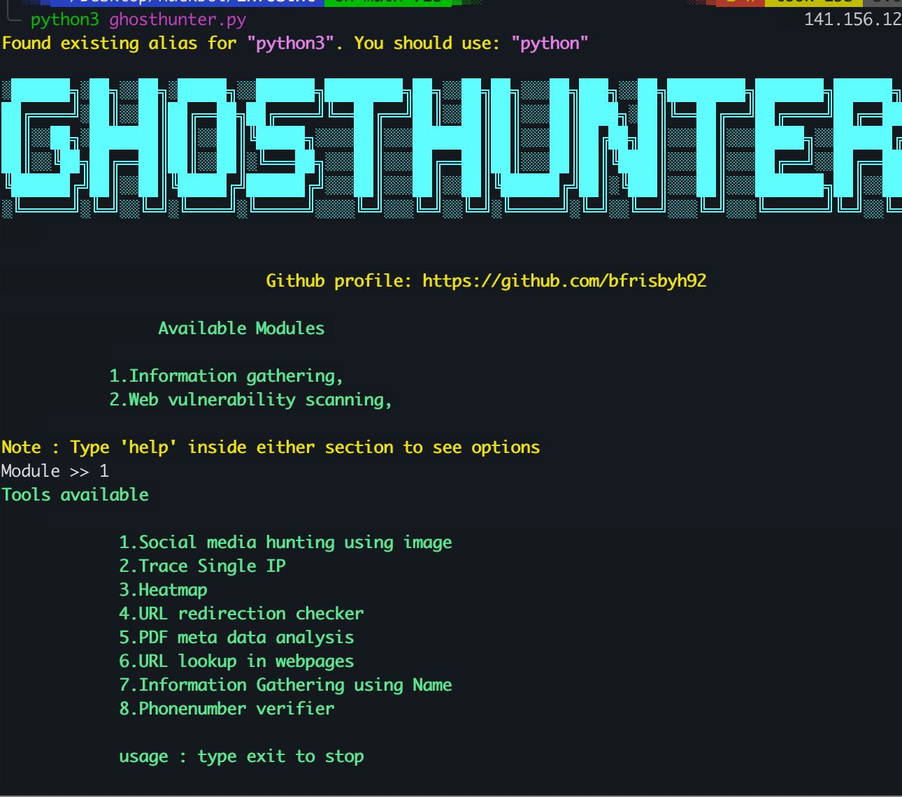

<h1 align="center">Ghost Hunter</h1>

GhostHunter is an Open source intelligence tool which is used to gather an information about an person using a single input like an image, name or IP address.

# Installation

- git clone https://github.com/bfrisbyh92/GhostHunter
- cd GhostHunter
- python3 ghosthunter.py

