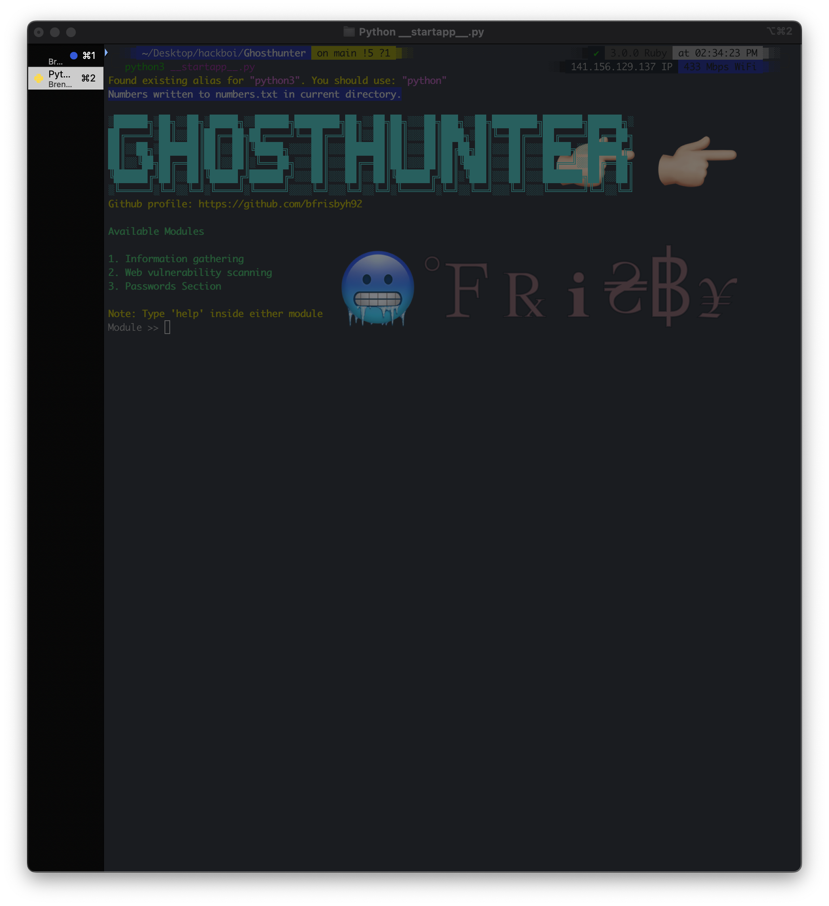
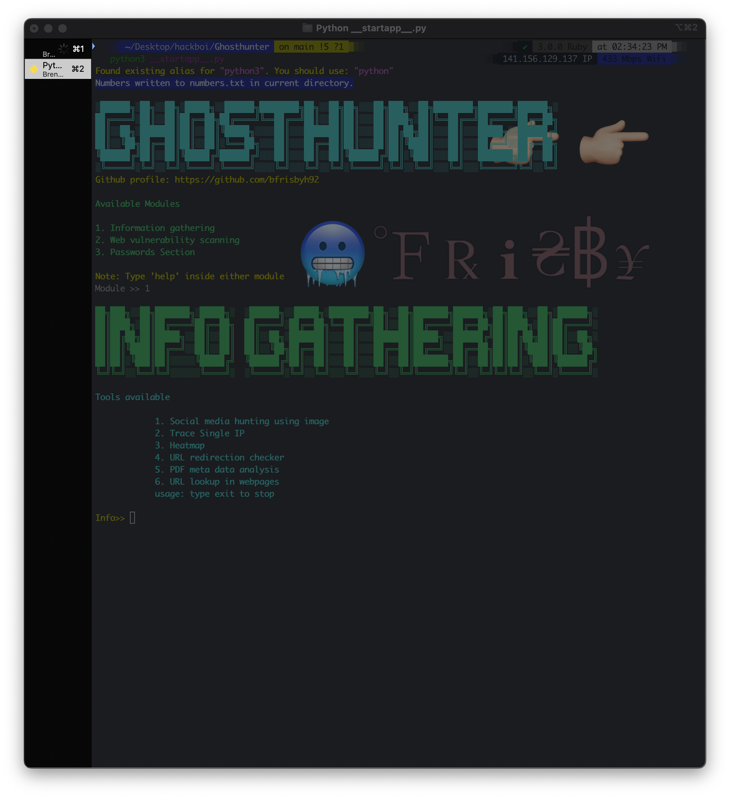
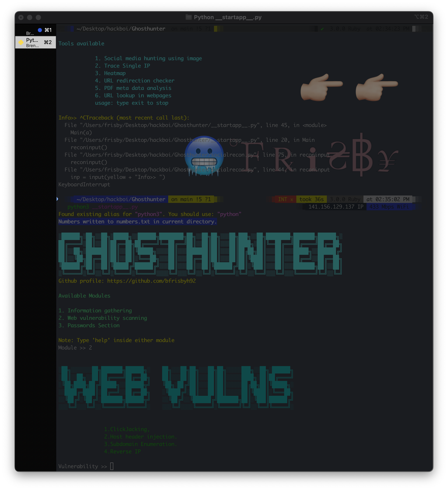
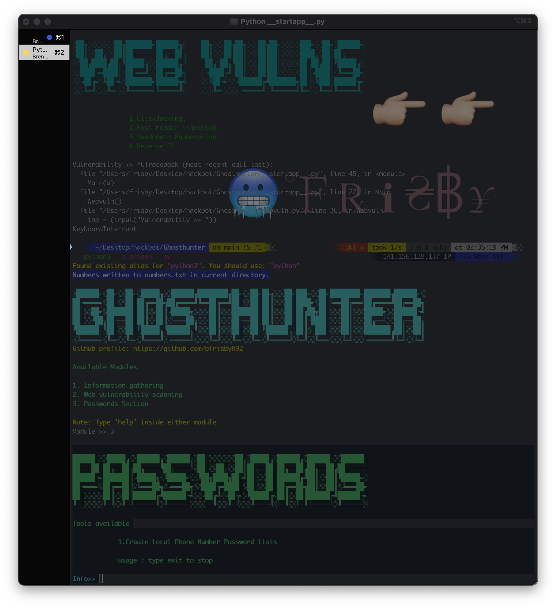

<h1 align="center">Ghost Hunter</h1>
<!-- <h3 align="center">Brendan Frisby 2023</h3> -->
----------
<h3 align="center"><a href="https://github.com/bfrisbyh92">Github</a></h3>

----------

GhostHunter is an Open source intelligence tool which is used to gather an information about an person using a single input like an image, name or IP address.

-------------
## To-Do
- Make a password area, for web scraping passwords, phone number password lists, and concatting words to create lists
- Maybe create networking options with Scapy for a few simple tasks like sniffing, monitoring traffic, capture images
- Organize projects structure better
- Add the ability to go back, instead of needing to close the program out and restart script
# Installation

- git clone https://github.com/bfrisbyh92/GhostHunter
- cd GhostHunter
- pip install -r requirements.txt
- python3 ghosthunter.py

-----------------------------

-----------------------------------------

-----------------------------------------

-----------------------------------------

-----------------------------------------
